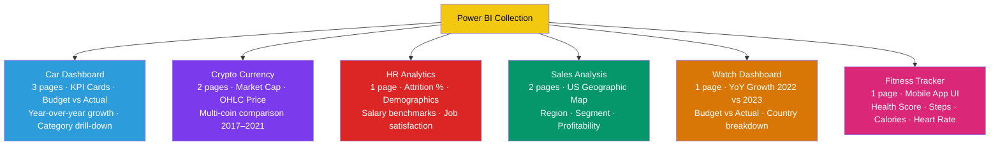
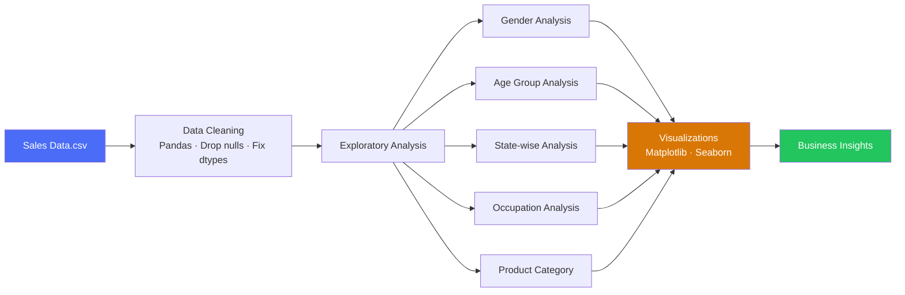
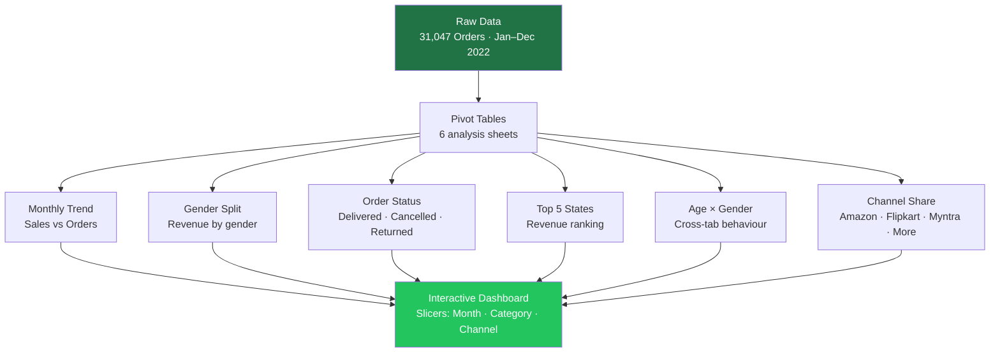
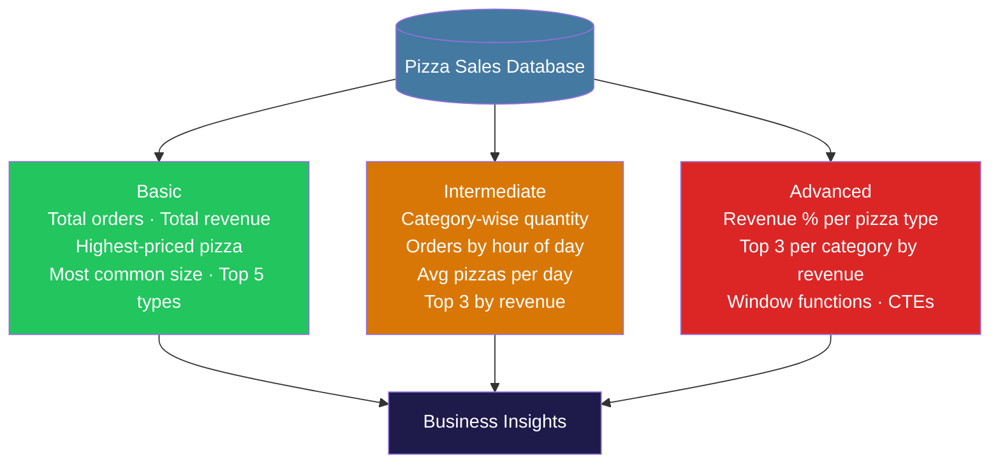
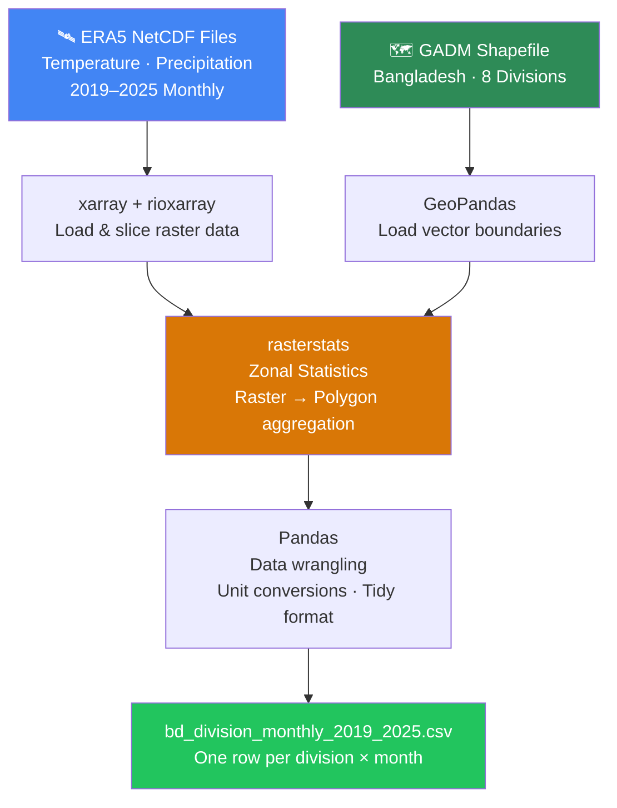

<div align="center">

#  Data-Analysis

### A curated collection of end-to-end data analysis projects spanning SQL, Python, Excel, Power BI, and Geospatial analysis

[](https://python.org)
[](https://powerbi.microsoft.com)
[](https://mysql.com)
[](https://microsoft.com/excel)
[](https://jupyter.org)
[](LICENSE)

*Nine repositories — from SQL querying and Excel dashboards to Python EDA, Power BI storytelling, and geospatial climate analysis — each solving a real-world data problem.*

</div>

---

##  Table of Contents

- [Overview](#-overview)
- [Repository Map](#-repository-map)
- [Projects](#-projects)
  - [Power BI Dashboards](#1--power-bi-dashboards)
  - [Sales Analysis — Python EDA](#2--sales-analysis--python-eda)
  - [Store Sales — Excel Dashboard](#3--store-sales--excel-dashboard)
  - [Pizza Sales — SQL](#4--pizza-sales--sql)
  - [Geospatial Climate Analysis](#5--geospatial-climate-analysis)
- [Python Foundations](#-python-foundations)
  - [NumPy](#6--numpy)
  - [Pandas](#7--pandas)
  - [Matplotlib](#8--matplotlib)
  - [Seaborn](#9--seaborn)
- [Tech Stack](#-tech-stack)
- [Analysis Pipeline](#-analysis-pipeline)
- [Author](#-author)

---

##  Overview

**Data-Analysis** is a structured collection of data projects covering the full analytics stack — from raw data ingestion and SQL querying to Python-based EDA, interactive Excel dashboards, Power BI storytelling, and geospatial climate data processing.

```
Data-Analysis/
├── power-bi/              # 6 interactive Power BI dashboards
├── sales-analysis/        # Python EDA on Diwali sales data
├── store-sales-dashboard/ # Excel dashboard — Vrinda Store (31K orders)
├── pizza-sales-sql/       # SQL analysis — Basic → Advanced queries
├── geospatial-climate/    # ERA5 climate pipeline — Bangladesh divisions
├── numpy-exercise/        # NumPy fundamentals (7 notebooks)
├── pandas-exercise/       # Pandas data manipulation (9 notebooks)
├── matplotlib-exercise/   # Matplotlib visualizations (13 notebooks)
└── seaborn-exercise/      # Seaborn statistical plots (15 notebooks)
```

---

##  Repository Map

| # | Project | Domain | Tools | Type |
|---|---|---|---|---|
| 1 | [Power BI Dashboards](#1--power-bi-dashboards) | Multi-domain | Power BI, DAX, Power Query | Dashboard |
| 2 | [Sales Analysis](#2--sales-analysis--python-eda) | Retail / EDA | Python, Pandas, Seaborn | EDA |
| 3 | [Store Sales Dashboard](#3--store-sales--excel-dashboard) | E-commerce | Excel, Pivot Tables | Dashboard |
| 4 | [Pizza Sales SQL](#4--pizza-sales--sql) | Food & Beverage | SQL | Data Analysis |
| 5 | [Geospatial Climate](#5--geospatial-climate-analysis) | Climate Science | Python, NetCDF, GeoPandas | Pipeline |
| 6 | [NumPy](#-python-foundations) | Foundations | NumPy, Jupyter | Exercise |
| 7 | [Pandas](#-python-foundations) | Foundations | Pandas, Jupyter | Exercise |
| 8 | [Matplotlib](#-python-foundations) | Foundations | Matplotlib, Jupyter | Exercise |
| 9 | [Seaborn](#-python-foundations) | Foundations | Seaborn, Jupyter | Exercise |

---

##  Projects

---

### 1.  Power BI Dashboards

> **6 professionally designed, fully interactive Power BI dashboards — spanning automotive, finance, HR, retail, luxury, and health domains.**

**→ Repository:** [Power-Bi](https://github.com/a-r-ashik/Power-Bi)

#### Dashboard Suite



#### Power BI Data Pipeline


#### Dashboard Highlights

| Dashboard | Key DAX / Features |
|---|---|
|  Car | Budget vs actual variance, YoY growth %, action buttons, 3-page navigation |
|  Crypto | OHLC price analysis, full date hierarchy, multi-coin slicer |
|  HR | Attrition rate KPI, department drill-down, gender/age segmentation |
|  Sales | US state heat map, customer segment funnel, profit margin analysis |
|  Watch | 2022 vs 2023 YTD comparison, region-level breakdown, growth % KPI |
|  Fitness | Custom SVG background, goal-range visuals, personalized welcome text |

#### Stack
`Power BI Desktop` · `DAX` · `Power Query (M)` · `Custom Visuals` · `SVG Backgrounds`

---

### 2.  Sales Analysis — Python EDA

> **Exploratory data analysis on Diwali season retail data — uncovering who buys what, where, and why.**

**→ Repository:** [Sales-Analysis-Project](https://github.com/a-r-ashik/Sales-Analysis-Project)

#### Analysis Pipeline



#### Key Findings

| Dimension | Insight |
|---|---|
| **Gender** | Female buyers dominate with higher purchasing power |
| **Age Group** | Females aged **26–35** are the primary segment |
| **Top States** | Uttar Pradesh, Maharashtra, Karnataka |
| **Occupation** | IT, Healthcare, Aviation professionals spend most |
| **Categories** | Food, Clothing, Electronics lead in sales |

> **Business Conclusion:** Married women aged 26–35 from UP, Maharashtra & Karnataka in IT/Healthcare are the highest-value customer segment during Diwali.

#### Stack
`Python` · `Pandas` · `NumPy` · `Matplotlib` · `Seaborn` · `Jupyter Notebook`

---

### 3.  Store Sales — Excel Dashboard

> **End-to-end Excel dashboard for Vrinda Store — 31,047 orders, ₹2.11 Cr revenue, 7 e-commerce platforms.**

**→ Repository:** [Store-Sales-Excel-Dashboard](https://github.com/a-r-ashik/Store-Sales-Excel-Dashboard)

#### Dashboard Coverage



#### Key Findings

| Metric | Value |
|---|---|
| Total Revenue | ₹2,11,76,377 |
| Orders Delivered | ~92% fulfilment rate |
| Top State | Maharashtra — ₹29.9 Lakh |
| Top Channel | Amazon, Flipkart, Myntra |
| Core Customer | Women aged 25–45 |
| Peak Month | March 2022 — ₹19.3 Lakh |

#### Stack
`Microsoft Excel` · `Pivot Tables` · `Slicers` · `Charts` · `Power Query`

---

### 4.  Pizza Sales — SQL

> **Multi-level SQL analysis — Basic, Intermediate, and Advanced queries on a pizza restaurant dataset.**

**→ Repository:** [Pizza-Sales---SQL-Project](https://github.com/a-r-ashik/Pizza-Sales---SQL-Project)

#### Query Progression



#### Stack
`SQL` · `MySQL / PostgreSQL` · `Aggregations` · `Joins` · `Window Functions` · `CTEs`

---

### 5.  Geospatial Climate Analysis

> **Production-grade Python pipeline — ERA5 reanalysis NetCDF data aggregated over Bangladesh's 8 administrative divisions (2019–2025).**

**→ Repository:** [Geospatial-climate-analysis-python](https://github.com/a-r-ashik/Geospatial-climate-analysis-python)

#### Processing Pipeline



#### Output Schema

| Column | Description |
|---|---|
| `division` | Bangladesh administrative division name |
| `year` | Year (2019–2025) |
| `month` | Month (1–12) |
| `mean_t2m_C` | Mean 2m air temperature (°C) |
| `total_precip_mm` | Total monthly precipitation (mm) |

#### Stack
`xarray` · `rioxarray` · `GeoPandas` · `rasterstats` · `Pandas` · `NumPy` · `ERA5 / Copernicus CDS`

---

##  Python Foundations

Supporting libraries mastered through dedicated exercise repositories — the backbone of every Python project above.

---

### 6.  NumPy

> **Numerical computing fundamentals — array operations, math, and statistics from scratch.**

**→ Repository:** [Numpy-Exercise](https://github.com/a-r-ashik/Numpy-Exercise) &nbsp;|&nbsp; **7 Notebooks**

| Notebook | Topics |
|---|---|
| Adding and Removing | `np.append`, `np.insert`, `np.delete` |
| Aggregating Functions | `sum`, `min`, `max`, `mean`, `cumsum` |
| Inspecting an Array | `shape`, `size`, `dtype`, `astype` |
| Join and Split | `concatenate`, `hstack`, `vstack` |
| Mathematical Operations | `add`, `subtract`, `multiply`, `sqrt`, `power` |
| Search · Sort · Filter | `sort`, `where` |
| Statistical Functions | `mean`, `median`, `std`, `var`, `corrcoef` |

---

### 7.  Pandas

> **Data manipulation and wrangling — the core tool behind every EDA project in this vault.**

**→ Repository:** [Pandas-Exercise](https://github.com/a-r-ashik/Pandas-Exercise) &nbsp;|&nbsp; **9 Notebooks**

| Notebook | Topics |
|---|---|
| DataFrames | Creating from dicts, CSV & Excel |
| Exploring Data | `head()`, `info()`, `describe()`, `isnull()` |
| Column Transformations | `.loc[]`, `.map()`, conditional columns |
| Handling Null Values | `isnull()`, `dropna()` |
| Handling Duplicates | `duplicated()`, `drop_duplicates()` |
| GroupBy | `groupby()` with `agg()` — count, mean, max |
| Merge · Concatenate · Join | `merge()`, `concat()`, join types |
| Pivot and Melting | `pivot()`, `melt()` for reshaping |

---

### 8.  Matplotlib

> **Core Python visualization — 13 chart types from basic plots to real-world data storytelling.**

**→ Repository:** [Matplotlib-Exercise](https://github.com/a-r-ashik/Matplotlib-Exercise) &nbsp;|&nbsp; **13 Notebooks**

| Notebook | Topics |
|---|---|
| Bar Plot | Vertical & horizontal bars, custom colors |
| Line Plot | Single & multi-line with date/amount data |
| Scatter Plot | Random and real employee data |
| Histogram | Frequency distributions with custom bins |
| Pie Chart | Brand market share and expense breakdown |
| Box Plot | Single and multiple distribution analysis |
| Stack Plot | Stacked area charts for trend comparison |
| Violin Plot | Distribution with median lines |
| Subplots | Multi-panel figure layouts |
| Save | Exporting plots as PNG, PDF |

---

### 9.  Seaborn

> **Statistical data visualization — 15 plot types with built-in and real-world datasets.**

**→ Repository:** [Seaborn-Exercise](https://github.com/a-r-ashik/Seaborn-Exercise) &nbsp;|&nbsp; **15 Notebooks**

| Notebook | Topics |
|---|---|
| Heatmap | Annotated pivot tables, grouped salary data |
| Pair Plot | Pairwise grids on Tips & Iris datasets |
| KDE Plot | Kernel Density Estimation with stacking |
| Violin | Distribution shape on Tips & employee data |
| Cat Plot | Figure-level categorical plots with `catplot()` |
| Count Plot | Frequency analysis with hue grouping |
| Scatter | Hue, size, palette — salary vs. age |
| Strip & Swarm | Categorical distribution without overlap |
| Relational Plot | Multi-dimensional encoding with `relplot()` |
| Multiple Plot | FacetGrid with mapped scatter and bar plots |

---

##  Tech Stack

| Layer | Technologies |
|---|---|
| **BI & Dashboarding** | Power BI Desktop, DAX, Power Query, Excel Pivot Tables |
| **Python Analysis** | Pandas, NumPy, Matplotlib, Seaborn |
| **Geospatial** | xarray, rioxarray, GeoPandas, rasterstats |
| **Database** | SQL (MySQL / PostgreSQL), aggregations, window functions |
| **Environment** | Jupyter Notebook, python-dotenv |
| **Data Formats** | CSV, Excel (.xlsx), NetCDF (.nc), Shapefiles (.shp) |

---

##  Analysis Pipeline


---

##  Author

**Ashikur Rahman**

[](https://github.com/a-r-ashik)
[](https://www.linkedin.com/in/ashikur-rahman-ashik-9798102b7/)

---

> *Also check out **[RAG-Vault](https://github.com/a-r-ashik/RAG-Vault)** — 5 RAG implementations, and **[Agentic-AI-Frameworks](https://github.com/a-r-ashik/Agentic-AI-Frameworks)** — LangGraph, CrewAI, LangChain & Streamlit projects.*

---

<div align="center">

*Built with curiosity, one dataset at a time.*

</div>
